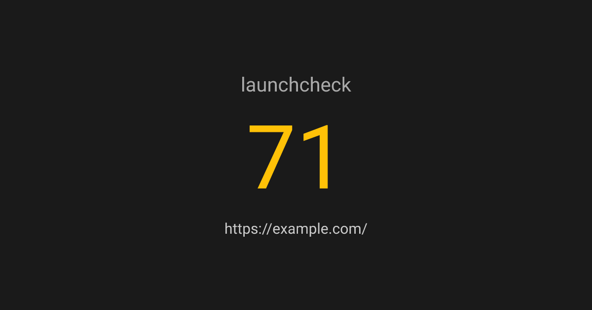

# 🚀 shipgrade

> Don't launch into the void. Grade your site before you ship.

**`shipgrade`** is a lightning-fast, local-first CLI tool that aggressively audits your website's SEO, social metadata, security headers, and performance best practices. It runs instantly from your terminal and generates a beautiful, actionable scorecard.



## Features

- **Blazing Fast**: Uses Cheerio to parse HTML without the heavy overhead of Puppeteer or Playwright.
- **35 Core Checks**: Validates everything from Open Graph images and Twitter cards to Content-Security-Policy headers and TTFB.
- **Local First**: Runs entirely on your machine. No cloud subscriptions, no tracking, no rate limits.
- **AI Agent Ready**: Use the `--fix` flag to pipe actionable repair instructions straight to your favorite coding assistant.
- **CI/CD Integration**: Supports `--fail-under <score>` and `--quiet` for seamless pipeline integration.

## Quickstart

You don't even need to install it. Just run it via `npx`:

```bash
npx shipgrade https://your-website.com
```

### Options

```
Usage:
  $ npx shipgrade <url>

Options:
  -f, --fail-under <score>  Exit with code 1 if the score is below the threshold
  -q, --quiet               Suppress the banner output for cleaner CI logs
  -h, --help                Display this message
  -v, --version             Display version number
```

## Checks Performed

**shipgrade** evaluates your site across five distinct categories:

- **SEO**: Canonical tags, H1 density, alt text coverage, JSON-LD structured data, sitemap.xml, robots.txt, and 404 integrity.
- **Social**: Open Graph metadata, Twitter Cards, and favicon/og:image reachability.
- **Security**: HTTPS enforcement, HSTS, X-Content-Type-Options, CSP, X-Frame-Options, Referrer-Policy, and Tech Stack Leak prevention.
- **Performance**: Compression, Time-to-First-Byte (TTFB), Cache-Control, HTML Document Size, Image Lazy-Loading, and Render-Blocking Script detection.
- **Mobile**: Viewport scaling metadata.
- **Reliability**: www vs non-www consistency and redirection mapping.

## Why shipgrade?

There are a lot of SEO and auditing tools out there (Lighthouse, Ahrefs, HubSpot's Website Grader). But **shipgrade** is built specifically for developers who want a quick, beautiful, terminal-native sanity check right before they click "Deploy." 

## License

MIT
