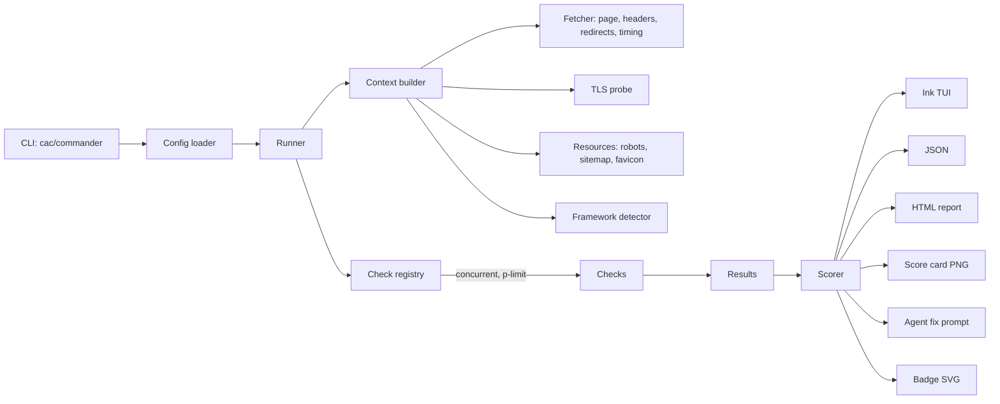

# launchcheck — Project Detail & Idea Report

> **One command. Any URL. A scored, fixable launch-readiness report, in under 10 seconds.**
> `npx launchcheck https://example.com`

| | |
|---|---|
| **Type** | Open-source CLI (npm package), terminal-first with HTML / PNG / JSON outputs |
| **Stack** | Node 20+, TypeScript, Ink (React for the terminal), cheerio, satori + resvg |
| **Target build time** | MVP in ~5 days, polish and launch in ~2 more weeks |
| **Status** | Idea validated, spec written, not yet built |

---

## 1. Executive summary

`launchcheck` audits a live website the way a picky launch reviewer would. It runs 35+ checks across SEO, social sharing, security, mobile, performance hints, and reliability, then presents:

- an animated **score out of 100** with a letter grade,
- the **top 5 fixes** in priority order,
- optional extras: a funny **roast mode**, a **shareable score card**, a **client-ready HTML report**, and an **agent-ready fix prompt** you can paste into Cursor, Claude Code, or Antigravity.

The product bet: audit tools exist, but most are heavy, need setup, or produce reports nobody wants to share. `launchcheck` wins on **speed, zero config, delight, and shareable output**.

## 2. Problem and opportunity

- Sites ship with missing meta tags, broken OG images, no sitemap, weak security headers, or accidental `noindex`. These are boring, fixable, and very common.
- Developers and agencies check by hand or juggle several tools. Small-business owners can't interpret raw audit output at all.
- AI coding tools make it easy to ship sites fast, so the "did I forget anything?" step matters more.
- Existing audit tools are powerful but heavyweight. There is room for a fast, friendly, opinionated first-pass checker with a strong demo.

**Honest caveat:** this space is not empty (for example Lighthouse / PageSpeed and site-crawling wrappers around it). Novelty is not the edge. The edge is the experience and the shareable output. A 30-minute GitHub and npm search should be done before committing (see section 17).

## 3. Goals and non-goals

**Goals**
1. Zero-config: `npx launchcheck <url>` works with no install and no flags.
2. Fast: full report in under 10 seconds for a typical site.
3. Actionable: every failure explains *what*, *why it matters*, and *how to fix it*.
4. Delightful: live-streaming UI, animated score, roast mode.
5. Shareable: score card image, HTML report, README badge.
6. CI-friendly: JSON output and exit codes.

**Non-goals (v1)**
- Not a Lighthouse replacement. No real Core Web Vitals in the base mode (that needs a browser).
- No full-site crawling (single page plus light link checks in v1).
- No authenticated or paywalled pages.
- No legal, accessibility-compliance, or GDPR guarantees. The tool gives hints, not certifications.

## 4. Target users and use cases

| User | Use case |
|---|---|
| Solo developer / indie hacker | Pre-launch checklist: "did I forget anything?" |
| Freelancer / agency dev | Client-ready report before handoff; audit report as an outreach hook |
| Student / portfolio builder | Polish a portfolio or project site |
| Team in CI | Fail the build if the score drops below a threshold |
| AI-assisted builders | Run the check, paste the generated fix prompt into an AI coding tool |

## 5. Feature set

### 5.1 MVP (v1.0)

| Feature | Description |
|---|---|
| Core scan | `launchcheck <url>` runs all checks concurrently against one page plus shared resources |
| Live TUI | Results stream in as checks finish; spinners, colored statuses |
| Animated score | Count-up animation, letter grade, per-category bars |
| Top fixes | 5 highest-impact failures with a concrete fix each |
| `--json` | Machine-readable output, stable schema |
| `--fail-under <n>` | Exit code 1 when score is below threshold (CI use) |
| `--roast` | Playful one-liners on failed checks (rule-based, no AI needed) |
| `--html <file>` | Self-contained, styled HTML report (single file, no external assets) |
| `--card <file>` | 1200×630 PNG score card for social sharing |
| `--fix` | Writes `FIXES.md`: an agent-ready prompt with failing checks, evidence, and framework-aware snippets |
| Plain fallback | Non-TTY or `NO_COLOR` gets clean plain-text output |

### 5.2 v1.x (post-launch)

- `--badge` to generate a README score badge (SVG).
- Config file (`launchcheck.config.json`): ignore checks, override weights, set thresholds.
- Compare mode: `launchcheck a.com b.com` shows scores side by side.
- Light crawl: `--crawl 20` audits up to N internal pages and aggregates issues.
- `--watch` re-runs on interval; `--baseline` flags regressions against a saved run.
- GitHub Action wrapper with PR comment.
- Webhook output (Slack / Discord).

### 5.3 v2 ideas

- `--browser` mode using Playwright for real Core Web Vitals, rendered-DOM checks for client-side apps, and screenshots in the report.
- Plugin API for custom checks (`launchcheck-plugin-*`).
- `--ai` opt-in: LLM-written explanations and roasts (off by default; data leaves the machine, so it must be explicit).
- History and trends (`launchcheck history <domain>`).
- Public "state of launch readiness" dataset from opt-in scans.

## 6. Check catalog (35+ checks)

Weights are 1–5 (5 = critical). Statuses: `pass`, `warn`, `fail`, `skip`, `info`.

### SEO (weight-heavy)
| ID | Check | Weight |
|---|---|---|
| `seo.status` | Page returns 200 (after redirects), not an error page | 5 |
| `seo.noindex` | No accidental `noindex` in meta robots or `X-Robots-Tag` | 5 |
| `seo.title` | `<title>` present, 30–60 chars, not generic ("Home", "Untitled") | 4 |
| `seo.description` | Meta description present, ~70–160 chars | 4 |
| `seo.canonical` | Canonical URL present and consistent with the final URL | 3 |
| `seo.h1` | Exactly one `<h1>`; sensible heading order | 3 |
| `seo.lang` | `<html lang>` set | 2 |
| `seo.robotstxt` | `robots.txt` exists and does not block the whole site | 4 |
| `seo.sitemap` | `sitemap.xml` exists, is valid XML, and is referenced in `robots.txt` | 3 |
| `seo.jsonld` | Valid JSON-LD structured data present (info if absent) | 2 |
| `seo.alt` | Image `alt` coverage percentage | 3 |
| `seo.404` | Random missing path returns a real 404 (not a soft 200) | 3 |

### Social sharing
| ID | Check | Weight |
|---|---|---|
| `social.og.title` / `og.description` | Open Graph title and description | 3 |
| `social.og.image` | `og:image` present, absolute URL, reachable, sensible size hint | 4 |
| `social.twitter` | `twitter:card` and related tags | 2 |
| `social.favicon` | Favicon and `apple-touch-icon` reachable | 2 |

### Security
| ID | Check | Weight |
|---|---|---|
| `sec.https` | HTTPS available; HTTP redirects to HTTPS | 5 |
| `sec.cert` | TLS certificate valid; warn when expiry < 21 days | 5 |
| `sec.hsts` | `Strict-Transport-Security` header | 3 |
| `sec.csp` | `Content-Security-Policy` present (warn if absent) | 2 |
| `sec.xcto` | `X-Content-Type-Options: nosniff` | 2 |
| `sec.frame` | `X-Frame-Options` or CSP `frame-ancestors` | 2 |
| `sec.referrer` | `Referrer-Policy` | 1 |
| `sec.mixed` | No mixed-content (http:// assets on https page) | 4 |
| `sec.leak` | No verbose `Server` / `X-Powered-By` version leakage | 1 |

### Mobile
| ID | Check | Weight |
|---|---|---|
| `mobile.viewport` | Viewport meta tag correct | 5 |
| `mobile.theme` | `theme-color` and web manifest (info) | 1 |
| `mobile.srcset` | Responsive images (`srcset` / `sizes`) usage | 2 |

### Performance hints (static, no browser)
| ID | Check | Weight |
|---|---|---|
| `perf.compress` | Response compressed (br / gzip) | 4 |
| `perf.cache` | Sensible `Cache-Control` on HTML and assets | 3 |
| `perf.ttfb` | Server response time (hint only, single-sample) | 3 |
| `perf.html` | HTML document size | 2 |
| `perf.images` | Image formats (WebP/AVIF) and oversized files via `HEAD` content-length | 3 |
| `perf.blocking` | Render-blocking scripts in `<head>` | 3 |
| `perf.fonts` | `font-display` / preconnect for web fonts | 1 |
| `perf.lazy` | `loading="lazy"` on below-the-fold images | 1 |

### Reliability
| ID | Check | Weight |
|---|---|---|
| `rel.links` | Broken internal links (capped sample) | 4 |
| `rel.images` | Broken images | 3 |
| `rel.redirects` | Redirect chain length | 2 |
| `rel.www` | `www` / non-`www` consistency | 2 |

> Performance checks are labeled **hints** in the UI. Real Core Web Vitals need a browser (v2 `--browser` mode).

## 7. Scoring model

- Each check yields a value: `pass = 1`, `warn = 0.5`, `fail = 0`. `skip` and `info` are excluded from the math.
- **Category score** = Σ(weight × value) / Σ(weight) × 100.
- **Overall score** = weighted average of categories:

| Category | Weight |
|---|---|
| SEO | 30 |
| Security | 20 |
| Performance hints | 20 |
| Social | 10 |
| Mobile | 10 |
| Reliability | 10 |

- **Critical caps:** if the page is unreachable, returns a non-2xx status, or is `noindex`, the overall score is capped at 40. Scores should never look healthy when the site is fundamentally broken.
- **Grades:** A+ ≥ 95, A ≥ 90, B ≥ 80, C ≥ 70, D ≥ 55, F < 55.
- **Top fixes** are ranked by `weight × (1 − value)`, then by ease of fix (a static `effort` tag per check: low / medium / high).

## 8. Terminal UX design

**Principles:** instant feedback, never a blank screen, show progress, end with a clear "what to do next".

```
 launchcheck v1.0                                   https://example.com
 ─────────────────────────────────────────────────────────────────────
  SEO          ✔ title        ✔ description   ✖ canonical   ⠋ sitemap
  Social       ✔ og:title     ✖ og:image      ✔ twitter     ✔ favicon
  Security     ✔ https        ✔ cert (61d)    ⚠ csp         ✖ hsts
  Mobile       ✔ viewport     ✔ srcset
  Performance  ✔ compression  ⚠ caching       ⠋ images
  Reliability  ⠋ links
 ─────────────────────────────────────────────────────────────────────
  SCORE   ████████████████░░░░   78 / 100     GRADE  C+

  TOP FIXES
   1. [SEO]      Add a canonical URL            → <link rel="canonical" …>
   2. [Social]   og:image returns 404           → fix path or upload 1200×630
   3. [Security] Missing HSTS header            → Strict-Transport-Security: …
```

**Behaviors**
- Checks stream in as they complete; spinner for in-flight checks.
- Score counts up with an easing animation, then grade appears.
- Colors respect `NO_COLOR`; non-TTY (pipes, CI) gets plain text automatically.
- Terminal-width aware: collapses to a single column under ~60 columns.
- `--quiet` prints only score and failures; `--verbose` shows evidence per check.
- Exit codes: `0` ok, `1` below `--fail-under`, `2` tool or network error.

## 9. System architecture



### 9.1 Data flow

1. **CLI** parses flags and the URL, normalizes it (adds `https://`, strips fragments).
2. **Runner** builds one shared **Context**: a single page fetch (manual redirect handling to record the chain), response headers and timing, a TLS certificate probe (`node:tls`), and lazily fetched `robots.txt`, `sitemap.xml`, and favicon. Checks never refetch what the context already has.
3. **Registry** holds all checks; the runner executes them concurrently with a concurrency cap and per-check timeouts (`AbortSignal.timeout`).
4. Each check returns a structured **Result** (see below). A check that throws becomes a `skip` with an error note, never a crash.
5. **Scorer** turns results into category scores, overall score, grade, and ranked fixes.
6. **Renderers** consume the same immutable `Report` object: TUI, JSON, HTML, PNG card, badge, and the agent prompt.

### 9.2 Core types

```ts
type Status = "pass" | "warn" | "fail" | "skip" | "info";

interface Check {
  id: string;                       // "seo.title"
  category: "seo" | "social" | "security" | "mobile" | "perf" | "reliability";
  title: string;
  weight: 1 | 2 | 3 | 4 | 5;
  effort: "low" | "medium" | "high";
  run(ctx: Context): Promise<CheckResult>;
}

interface CheckResult {
  status: Status;
  message: string;                  // what we found
  evidence?: string;                // raw value / snippet
  fix?: string;                     // how to fix
  docsUrl?: string;                 // reference link
}

interface Report {
  url: string; finalUrl: string; scannedAt: string; tool: { name: string; version: string };
  score: number; grade: string;
  categories: Record<string, { score: number; results: (CheckResult & { id: string })[] }>;
  topFixes: { id: string; message: string; fix: string }[];
  framework?: "next" | "nuxt" | "astro" | "wordpress" | "unknown";
}
```

### 9.3 Project structure

```
launchcheck/
├─ package.json            # "bin": { "launchcheck": "dist/cli.js" }
├─ tsconfig.json
├─ tsup.config.ts          # ESM bundle, shebang, node20 target
├─ README.md               # pitch, GIF, install, flags, check list
├─ src/
│  ├─ cli.ts               # flags, exit codes
│  ├─ config.ts            # launchcheck.config.json + defaults
│  ├─ runner.ts            # context + concurrent execution
│  ├─ types.ts
│  ├─ context/
│  │  ├─ fetcher.ts        # redirects, headers, timing
│  │  ├─ tls.ts            # cert expiry
│  │  ├─ resources.ts      # robots, sitemap, favicon
│  │  └─ framework.ts      # detect Next / Nuxt / Astro / WordPress
│  ├─ checks/
│  │  ├─ index.ts          # registry
│  │  ├─ seo/  social/  security/  mobile/  perf/  reliability/
│  ├─ score.ts             # weighting, caps, grades, top fixes
│  ├─ roast/               # templates keyed by check id + score band
│  ├─ ui/                  # Ink: Header, CheckGrid, ScoreDial, TopFixes
│  └─ report/
│     ├─ json.ts  html.ts  card.tsx  badge.ts  agent-prompt.ts
├─ test/
│  ├─ fixtures/            # saved HTML + headers for good/bad sites
│  └─ *.test.ts
└─ .github/workflows/      # CI + npm publish on tag
```

## 10. Output formats

### 10.1 JSON (stable schema, versioned)
Includes `schemaVersion`, the full `Report`, and per-check results. Intended for CI and dashboards. Breaking changes bump `schemaVersion`.

### 10.2 HTML report
Single self-contained file (inline CSS, no external assets): score header, category breakdown, every check with evidence and fix, timestamp, and a "re-run" command. White-label option later (custom logo and title via config).

### 10.3 Score card (PNG, 1200×630)
Rendered with **satori** (JSX to SVG) and **@resvg/resvg-js** (SVG to PNG): domain, big score and grade, category bars, one roast line, and a small "checked with launchcheck" footer. Only public data (domain, score) appears on the card.

### 10.4 Agent fix prompt (`--fix` → `FIXES.md`)
Turns failures into a prompt an AI coding tool can act on: what failed, evidence, the exact fix, and **framework-aware snippets** (for example the Next.js Metadata API for title, description, canonical, and OG tags; Astro and Nuxt equivalents). This is the differentiator for AI-assisted builders.

## 11. Roast mode design

- Rule-based templates keyed by check ID, so it is instant, free, offline, and deterministic.
- Two intensities: `--roast` (light) and `--roast=savage`.
- A score-band verdict line at the end (for example a different closing line for F vs. A).
- **Guardrails:** no profanity by default, no personal or discriminatory jokes, and roasts target *the site's technical gaps*, never people. Always paired with the real fix so the humor never replaces the help.
- Optional `--ai` roasts in v2, clearly opt-in.

## 12. Tech stack and rationale

| Choice | Why |
|---|---|
| Node 20+ / TypeScript | Native `fetch`, familiar stack, easy `npx` distribution |
| Ink | React model for the terminal; live-updating UI without manual cursor control |
| cheerio | Fast, jQuery-style HTML parsing, no browser needed |
| p-limit | Simple concurrency control for checks and link probes |
| cac or commander | Lightweight CLI parsing |
| tsup (or tsdown) | Single-file ESM bundle with shebang; fast cold start |
| satori + resvg-js | Pure-JS card rendering, no headless browser |
| vitest | Fast TS-native tests with fixture HTML |
| VHS (Charm) | Scripted, reproducible terminal demo GIF for the README |

## 13. Performance, reliability, and safety

- **Speed budget:** context fetch in parallel, checks concurrent, link checks capped (default 30 same-origin links, `HEAD` with `GET` fallback, 5 concurrent).
- **Timeouts:** 8–10 s per request, overall cap around 25 s; partial results are reported rather than failing the run.
- **Politeness:** identifiable user agent (`launchcheck/x.y (+repo url)`), respects rate limits, no aggressive scanning. Crawl mode (v1.x) must respect `robots.txt`.
- **Privacy:** local-first. No telemetry by default. Nothing is uploaded; the score card is generated locally.
- **Hosted use (if ever added):** would require SSRF protection (block private / link-local IP ranges, DNS-rebinding checks), rate limiting, and abuse controls. Not needed for the local CLI.
- **Error handling:** every check isolated; one failing check never aborts the run.
- **Known limitation:** static fetch cannot see content rendered client-side. SSR / SSG frameworks (Next.js, Astro, Nuxt) work fine; pure SPAs may under-report until `--browser` mode exists. The report says so when it detects a near-empty HTML shell.

## 14. Testing strategy

- **Unit tests:** every check against saved HTML and header fixtures (a "perfect" site, a "terrible" site, and edge cases per check).
- **Scoring tests:** snapshot the score for fixture sites; verify caps and grade boundaries.
- **Renderer tests:** snapshot JSON and HTML; visual check for the card.
- **Integration tests:** run against a local test server that serves configurable good and bad pages, including redirects, slow responses, and broken links.
- **CI matrix:** Node 20 and 22; Linux, macOS, Windows (terminal rendering and path issues matter here).

## 15. Distribution and packaging

- npm package with a `bin` entry; primary path is `npx launchcheck`.
- Confirm the name is free (`npm view launchcheck`); prepare fallback names early.
- MIT license.
- Releases via GitHub Actions on version tags; changelog kept from day one.
- Later: Homebrew tap, GitHub Action (`launchcheck/action`), and Docker image.

## 16. Growth and launch plan

**Assets to prepare before launch**
1. A crisp README first line and a **10-second demo GIF** (VHS): run on a deliberately bad site, watch the score climb after fixes.
2. A sample HTML report and sample score cards in the repo.
3. A "before / after" screenshot of one real site fixed with the `--fix` prompt in an AI coding tool.

**Launch steps**
- Show HN, r/webdev, r/SideProject, X/LinkedIn thread with score cards, dev.to write-up ("How I built a terminal site auditor").
- Content hook: audit a batch of popular or public sites and publish aggregate findings (stick to public facts, no shaming individual sites).
- Encourage sharing: every score card and badge carries the tool name and repo URL.
- GitHub hygiene: clear topics, "good first issue" labels for new checks, a `CONTRIBUTING.md` that explains adding a check in ~20 lines.

**Why this can spread:** a low-friction try (`npx`, no setup), a screenshot-worthy output, and community-contributable checks.

## 17. Competitive landscape and differentiation

| Alternative | Strength | Where launchcheck differs |
|---|---|---|
| Lighthouse / PageSpeed | Real Core Web Vitals, deep audits | Heavier, browser-based, not a quick first-pass checker |
| Site-crawl audit wrappers | Whole-site coverage | Setup and output are heavier; less shareable |
| Browser SEO extensions | Convenient | Not scriptable, no CI, no terminal |
| Assorted npm SEO checkers | Simple | Typically narrower coverage and no polished UX |

**Action item before building:** search GitHub and npm for "site audit CLI", "seo checker cli", "website launch checklist cli", and note star counts and last-commit dates. If a leader with thousands of stars already owns "fast zero-config audit CLI", lean harder on the differentiators: roast + card, framework-aware `--fix`, and agent workflow.

**Differentiators to protect**
1. Zero-config speed.
2. Shareable outputs (card, badge, HTML).
3. Framework-aware fix prompts for AI coding tools.
4. Personality (roast) with real substance behind it.

## 18. Risks and mitigations

| Risk | Mitigation |
|---|---|
| Crowded category | Compete on UX and shareability; verify the landscape early |
| False positives erode trust | Conservative checks, `warn` over `fail` when unsure, evidence shown for every result |
| SPA sites under-report | Detect empty shells and say so; add `--browser` mode in v2 |
| Slow or flaky targets | Timeouts, partial results, retry once |
| Scope creep | Freeze the MVP list; everything else goes on the roadmap |
| Roast tone misfires | Rule-based, mild default, opt-in savage, technical-only targets |
| npm name taken | Check now; keep 2–3 fallback names |

## 19. Business and career angle

- **Portfolio:** a polished open-source CLI with a demo is strong proof of engineering and product taste.
- **Freelance / agency use:** run it on prospects' sites and send the HTML report as a value-first outreach message; use it as a pre-handoff QA step on client projects.
- **Possible later monetization (optional):** hosted reports, white-label branding, scheduled monitoring, and a paid GitHub Action tier. Keep the core CLI free and open source.

## 20. Roadmap and timeline

| When | Milestone |
|---|---|
| **Day 1** | Runner, context, fetcher, 10 core checks, plain-text output |
| **Day 2** | Ink UI: streaming check grid, score animation, grade |
| **Day 3** | Scoring polish, `--json`, roast mode, HTML report, score card, `--fix` prompt |
| **Day 4** | Remaining checks (links, images, security, perf hints), tests with fixtures, CI |
| **Day 5** | README, VHS demo GIF, name check, npm publish (v0.1 beta) |
| **Week 2** | Feedback fixes, config file, badge, launch posts |
| **Week 3+** | Compare mode, light crawl, GitHub Action, then `--browser` mode |

## 21. Definition of done (v1.0)

- [ ] `npx launchcheck <url>` works on a clean machine with no setup
- [ ] 35+ checks implemented with fixtures and tests
- [ ] Full report in under 10 s on typical sites
- [ ] TUI, plain-text, and `--json` outputs all working
- [ ] Roast, HTML report, score card, and `--fix` prompt shipped
- [ ] `--fail-under` and exit codes documented and tested
- [ ] Windows, macOS, and Linux verified
- [ ] README with demo GIF, flag reference, and "add a check" guide
- [ ] Published to npm with a tagged release

## 22. Open decisions

1. **Final name** (verify npm and GitHub availability).
2. **Roast default:** off by default (recommended) vs. on.
3. **CLI lib:** `cac` vs. `commander`.
4. **Bundler:** `tsup` vs. `tsdown`.
5. **Score weights:** review after testing against 20–30 real sites; tune to avoid all-A or all-F distributions.
6. **Scope of v1 link checking:** same-origin only (recommended) vs. external links too.

---

*Next step: build the v0 scaffold (package.json, runner, first 8 checks, basic Ink UI) and run it against a real URL before expanding the check list.*
